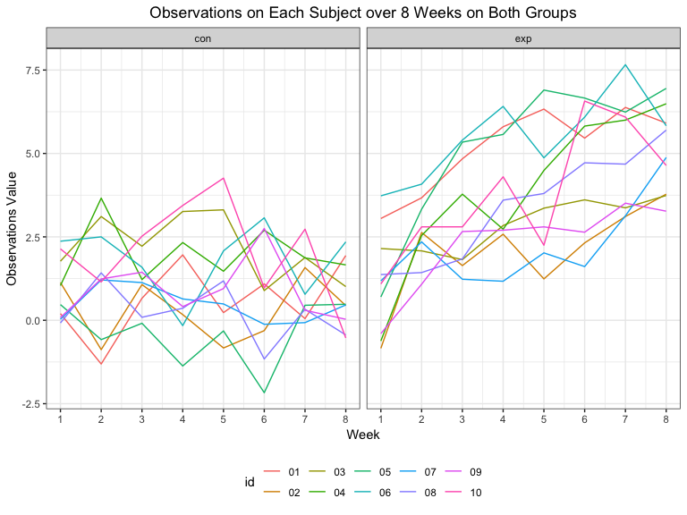
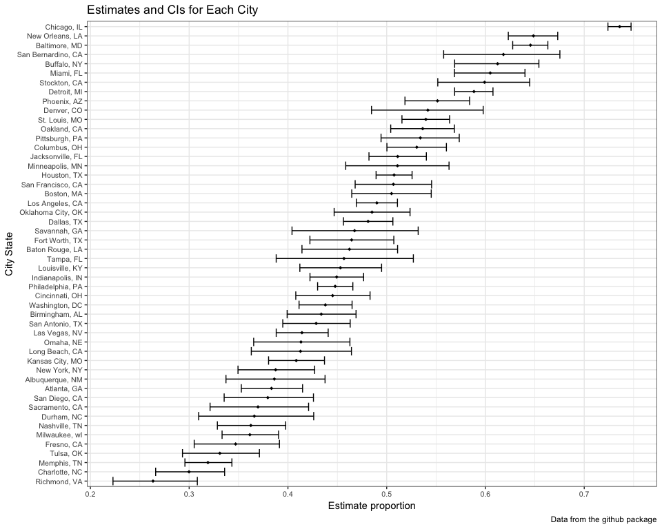

p8105\_hw5\_hx2263
================
Tiffany Xi
11/3/2018

Problem 1
=========

Import and tidy data
--------------------

Create a dataframe containing all file names

``` r
file_names = tibble(
  id = list.files(path = "./data")
) 
```

Iterate over file names and read in data for each subject using purrr::map and saving the result as a new variable in the dataframe

``` r
study_data = 
  file_names %>% 
    mutate(data = map(.x = id, ~read_csv(str_c("./data/", .x)))) 
```

Tidy the result; manipulate file names to include control arm and subject ID, make sure weekly observations are “tidy”, and do any other tidying that’s necessary

``` r
study_data_tidy = 
  study_data %>% 
  unnest() %>% 
  separate(id, into = c("arm_type", "id")) %>% 
  mutate(subject_id = str_c(arm_type, id)) %>%
  gather(key = "week", value = "obs_value", week_1:week_8) %>% 
  separate(week, into = c("nn", "week"), sep = "_") %>% 
  select(-nn) %>% 
  mutate(week = as.numeric(week))
study_data_tidy
```

    ## # A tibble: 160 x 5
    ##    arm_type id    subject_id  week obs_value
    ##    <chr>    <chr> <chr>      <dbl>     <dbl>
    ##  1 con      01    con01          1      0.2 
    ##  2 con      02    con02          1      1.13
    ##  3 con      03    con03          1      1.77
    ##  4 con      04    con04          1      1.04
    ##  5 con      05    con05          1      0.47
    ##  6 con      06    con06          1      2.37
    ##  7 con      07    con07          1      0.03
    ##  8 con      08    con08          1     -0.08
    ##  9 con      09    con09          1      0.08
    ## 10 con      10    con10          1      2.14
    ## # ... with 150 more rows

### Spaghetti plot showing observations on each subject over time

``` r
study_data_tidy %>% 
  ggplot(aes(x = week, y = obs_value, color = id)) +
  geom_line() +
  facet_grid(~ arm_type) +
  labs(
    title = "Observations on Each Subject over 8 Weeks on Both Groups", 
    x = "Week", 
    y = "Observations Value", 
    legend = "Group type"
  ) +
  scale_x_continuous(breaks = c(1:8))
```



**Comment**:

All subjects are at same level in 1st week but observations values in experimental group end in higher level than control arm. There are obvious increasing trend in experimental group, while in control group, values remain fluctuating in same level.

Problem 2
=========

### Import data

``` r
raw_homicide = read.csv("https://raw.githubusercontent.com/washingtonpost/data-homicides/master/homicide-data.csv")
```

**Description of raw data**

The raw dataset contains 12 columns and 52179 rows, wich means there are 12 variables and 52179 observations. Variables include uid, reported\_date, victim\_last, victim\_first, victim\_race, victim\_age, victim\_sex, city, state, lat, lon, disposition repectively stand for ID, death date, victim first name, last name, race, age and gender, site latitude and longtitude, city and states, dispostion.

### Create a city\_state variable

``` r
homicide_tidy = 
  raw_homicide %>% 
  mutate(city_state = str_c(city, ", ", state)) 
```

In the problem description, this dataset should contains homicides from 50 cities, but after summarizing city\_state, there are 51 cities. There is two "Tulsa". There is only one homicide in the row of "Tulsa, AL". Also, after googling we know that Tulsa is in OK, and the longitude and latitude also shows that this homicide was happened in Tulsa, OK. "Tulsa, AL" might be a typo in dataset, so I exclude this observation before further analysis.

``` r
homicide_tidy = homicide_tidy %>% 
  filter(city_state != "Tulsa, AL")
```

### Summarize within cities to obtain the Total Number of Homicides

``` r
total_num = 
  homicide_tidy %>% 
  group_by(city_state) %>%
  summarise(total_number = n())
total_num
```

    ## # A tibble: 50 x 2
    ##    city_state      total_number
    ##    <chr>                  <int>
    ##  1 Albuquerque, NM          378
    ##  2 Atlanta, GA              973
    ##  3 Baltimore, MD           2827
    ##  4 Baton Rouge, LA          424
    ##  5 Birmingham, AL           800
    ##  6 Boston, MA               614
    ##  7 Buffalo, NY              521
    ##  8 Charlotte, NC            687
    ##  9 Chicago, IL             5535
    ## 10 Cincinnati, OH           694
    ## # ... with 40 more rows

### Number of Unsolved Homicides

``` r
total_unslv = 
  homicide_tidy %>% 
  filter(disposition == "Closed without arrest" | disposition == "Open/No arrest") %>% 
  group_by(city_state) %>% 
  summarise(total_unsolved = n())
total_unslv
```

    ## # A tibble: 50 x 2
    ##    city_state      total_unsolved
    ##    <chr>                    <int>
    ##  1 Albuquerque, NM            146
    ##  2 Atlanta, GA                373
    ##  3 Baltimore, MD             1825
    ##  4 Baton Rouge, LA            196
    ##  5 Birmingham, AL             347
    ##  6 Boston, MA                 310
    ##  7 Buffalo, NY                319
    ##  8 Charlotte, NC              206
    ##  9 Chicago, IL               4073
    ## 10 Cincinnati, OH             309
    ## # ... with 40 more rows

### Baltimore, MD--estimate the proportion of unsolved homicides

``` r
bm_total = total_num %>%
  filter(city_state == "Baltimore, MD")

bm_unsolved = total_unslv %>%
  filter(city_state == "Baltimore, MD")

prop_test_bm = prop.test(bm_unsolved$total_unsolved, bm_total$total_number)

prop_test_bm %>% 
  broom::tidy() %>%
  select(estimate, conf.low, conf.high) %>%
  knitr::kable(digits = 3)
```

|  estimate|  conf.low|  conf.high|
|---------:|---------:|----------:|
|     0.646|     0.628|      0.663|

### Prop.test for each of the cities

``` r
prop_all_est = 
  total_num %>% 
  mutate(total_hom = map2(total_unslv$total_unsolved, 
                          total_num$total_number, prop.test)) %>% 
  mutate(total_hom = map(total_hom, broom::tidy)) %>% 
  unnest() %>% 
  select(city_state, estimate, conf.low, conf.high)

prop_all_est %>%
  knitr::kable(digits = 3)
```

| city\_state        |  estimate|  conf.low|  conf.high|
|:-------------------|---------:|---------:|----------:|
| Albuquerque, NM    |     0.386|     0.337|      0.438|
| Atlanta, GA        |     0.383|     0.353|      0.415|
| Baltimore, MD      |     0.646|     0.628|      0.663|
| Baton Rouge, LA    |     0.462|     0.414|      0.511|
| Birmingham, AL     |     0.434|     0.399|      0.469|
| Boston, MA         |     0.505|     0.465|      0.545|
| Buffalo, NY        |     0.612|     0.569|      0.654|
| Charlotte, NC      |     0.300|     0.266|      0.336|
| Chicago, IL        |     0.736|     0.724|      0.747|
| Cincinnati, OH     |     0.445|     0.408|      0.483|
| Columbus, OH       |     0.530|     0.500|      0.560|
| Dallas, TX         |     0.481|     0.456|      0.506|
| Denver, CO         |     0.542|     0.485|      0.598|
| Detroit, MI        |     0.588|     0.569|      0.608|
| Durham, NC         |     0.366|     0.310|      0.426|
| Fort Worth, TX     |     0.464|     0.422|      0.507|
| Fresno, CA         |     0.347|     0.305|      0.391|
| Houston, TX        |     0.507|     0.489|      0.526|
| Indianapolis, IN   |     0.449|     0.422|      0.477|
| Jacksonville, FL   |     0.511|     0.482|      0.540|
| Kansas City, MO    |     0.408|     0.380|      0.437|
| Las Vegas, NV      |     0.414|     0.388|      0.441|
| Long Beach, CA     |     0.413|     0.363|      0.464|
| Los Angeles, CA    |     0.490|     0.469|      0.511|
| Louisville, KY     |     0.453|     0.412|      0.495|
| Memphis, TN        |     0.319|     0.296|      0.343|
| Miami, FL          |     0.605|     0.569|      0.640|
| Milwaukee, wI      |     0.361|     0.333|      0.391|
| Minneapolis, MN    |     0.511|     0.459|      0.563|
| Nashville, TN      |     0.362|     0.329|      0.398|
| New Orleans, LA    |     0.649|     0.623|      0.673|
| New York, NY       |     0.388|     0.349|      0.427|
| Oakland, CA        |     0.536|     0.504|      0.569|
| Oklahoma City, OK  |     0.485|     0.447|      0.524|
| Omaha, NE          |     0.413|     0.365|      0.463|
| Philadelphia, PA   |     0.448|     0.430|      0.466|
| Phoenix, AZ        |     0.551|     0.518|      0.584|
| Pittsburgh, PA     |     0.534|     0.494|      0.573|
| Richmond, VA       |     0.263|     0.223|      0.308|
| Sacramento, CA     |     0.370|     0.321|      0.421|
| San Antonio, TX    |     0.429|     0.395|      0.463|
| San Bernardino, CA |     0.618|     0.558|      0.675|
| San Diego, CA      |     0.380|     0.335|      0.426|
| San Francisco, CA  |     0.507|     0.468|      0.545|
| Savannah, GA       |     0.467|     0.404|      0.532|
| St. Louis, MO      |     0.540|     0.515|      0.564|
| Stockton, CA       |     0.599|     0.552|      0.645|
| Tampa, FL          |     0.457|     0.388|      0.527|
| Tulsa, OK          |     0.331|     0.293|      0.371|
| Washington, DC     |     0.438|     0.411|      0.465|

### Plot

that shows the estimates and CIs for each city – check out geom\_errorbar for a way to add error bars based on the upper and lower limits. Organize cities according to the proportion of unsolved homicides.

``` r
prop_all_est %>%
  ggplot(aes(x = reorder(city_state, estimate), y = estimate)) +
  coord_flip() + 
  geom_point(size = 1.5, shape = 18, fill = "white") +
  geom_errorbar(mapping = aes(ymin = conf.low, ymax = conf.high)) +
  labs(
        title = "Estimates and CIs for Each City",
        x = "City State",
        y = "Estimate proportion",
        caption = "Data from the github package"
      ) +
    theme_bw() +
    theme(axis.text = element_text(size = 8))
```


